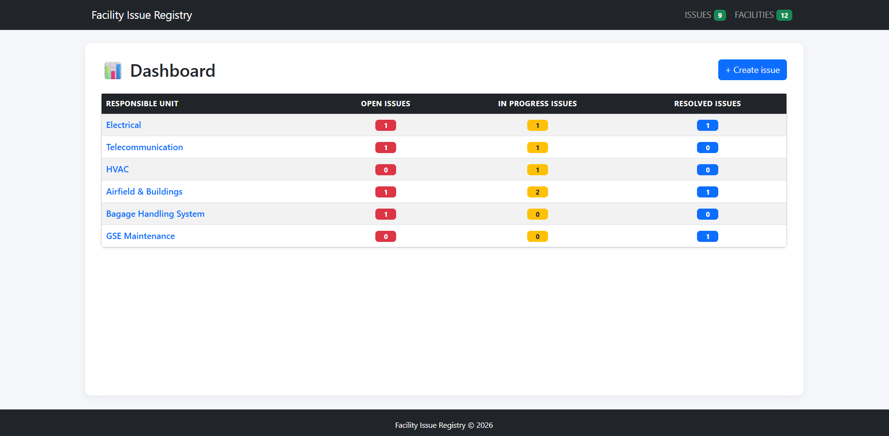
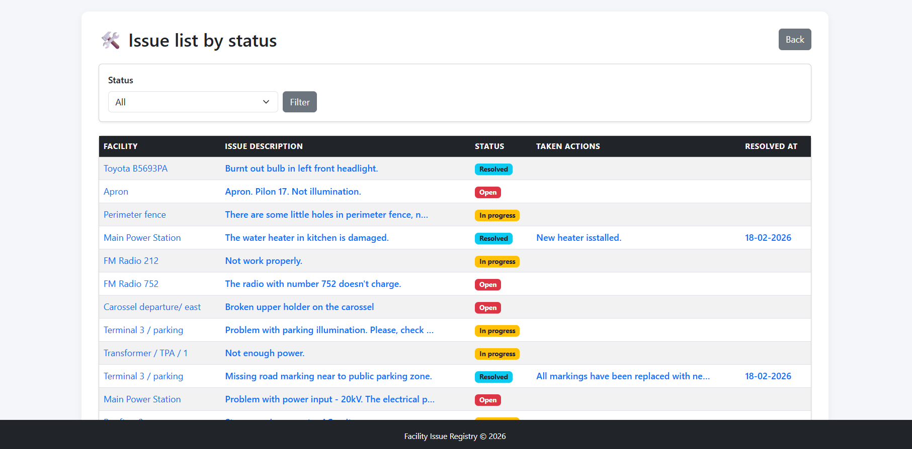

# Facility Issue Registry

------------------------------------------------------------------------

## 📋 Project Overview

**Facility Issue Registry** is a Django-based web application designed
to register, manage, and track technical issues in airport facilities
and infrastructure.

The system allows users to register facilities, report issues, and track
maintenance actions until the issue is resolved.

The project demonstrates core Django concepts including:

-   Models and ORM relationships
-   Forms and validation 
-   Class-based views
-   Template inheritance
-   CRUD operations
-   PostgreSQL integration
-   Bootstrap-based UI

------------------------------------------------------------------------

# 🛠 Key Features

## 1. Facility Management

-   Create, edit, delete, and view facility details
-   Upload facility images
-   Organize facilities by responsible unit
-   Dashboard summarizing issues per unit

## 2. Issue Management

-   Create, edit, delete, and view issues
-   Issue priorities and statuses
-   Image attachments for issues
-   Issues linked to specific facilities
-   Filter issues by status

Issue statuses: - Open - In Progress - Resolved - Closed

## 3. Maintenance Actions

-   Create maintenance actions for issues
-   Track who performed the action
-   Record cost and delivery requests
-   Resolve issues through maintenance actions

------------------------------------------------------------------------

# 📦 Technologies

-   Python 3.11
-   Django 5.2+
-   PostgreSQL
-   Bootstrap 5
-   Git

------------------------------------------------------------------------

# 🗂 Project Structure

The project contains three Django apps:

## facilities

Models: - Unit - Facility

## issues

Models: - Issue - Tag

## maintenance

Model: - MaintenanceAction

------------------------------------------------------------------------

# 📝 Installation and Running

## 1. Clone the repository

git clone https://github.com/KrasiRalchev/Facility-Issue-Registry.git 
cd facility_issue_registry

## 2. Create virtual environment

python -m venv venv

Activate:

source venv/bin/activate      # Linux / MacOS

venv\Scripts\activate         # Windows

## 3. Install dependencies

pip install -r requirements.txt

## 4. Apply migrations

python manage.py makemigrations 
python manage.py migrate

------------------------------------------------------------------------

# ⚠ IMPORTANT -- Load Initial Data

Before creating Issues you must load the fixture data:

python manage.py loaddata
facilities/fixtures/initial_units_facilities.json

This loads required **Units** and **Facilities** for the Issue form.

------------------------------------------------------------------------

## 5. Run the server

python manage.py runserver

Open in browser:

http://127.0.0.1:8000/

------------------------------------------------------------------------

# ⚡ Features

-   Full CRUD for Facilities and Issues
-   Maintenance actions linked to issues
-   Issue status and priority tracking
-   Bootstrap responsive interface
-   Filtering issues by status
-   Custom template tags
-   Custom 404 page

------------------------------------------------------------------------

## 📸 Application Screenshots

### Dashboard

### Issue List

### Facility List
