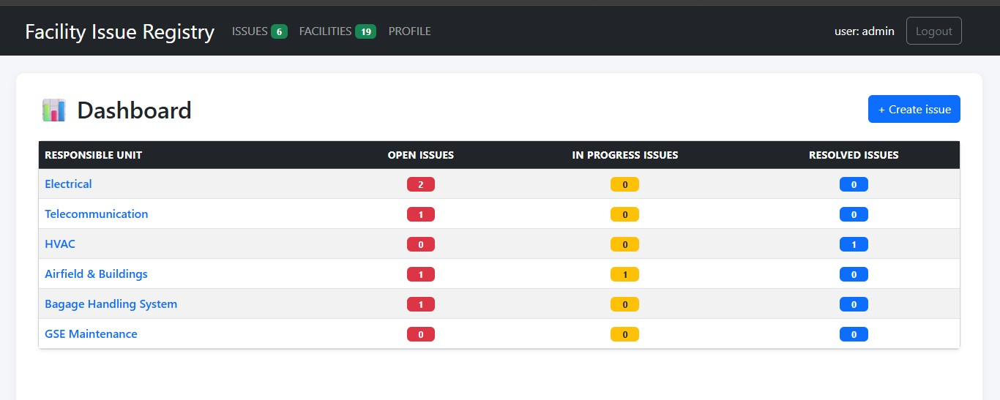
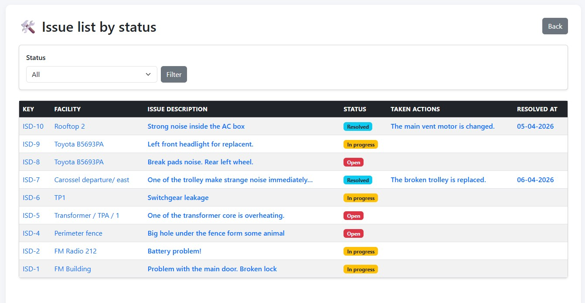
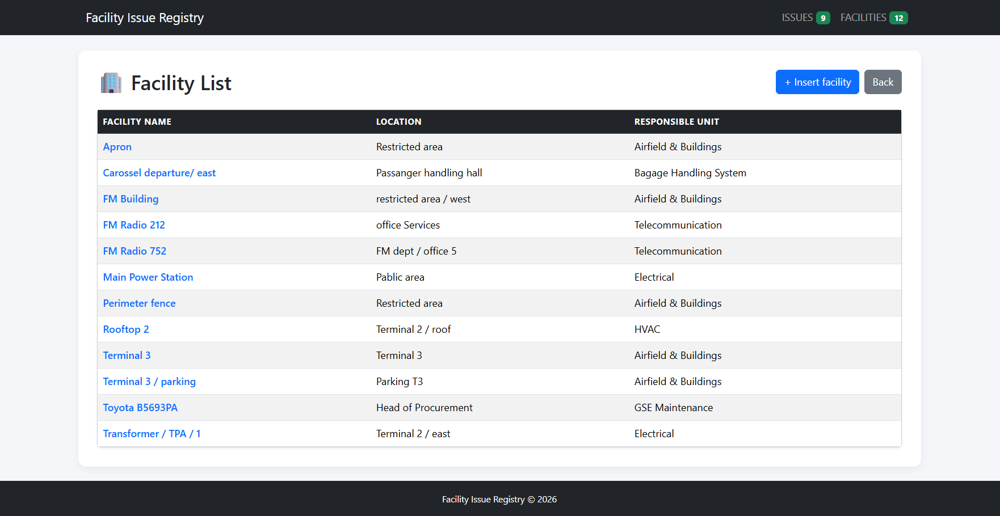
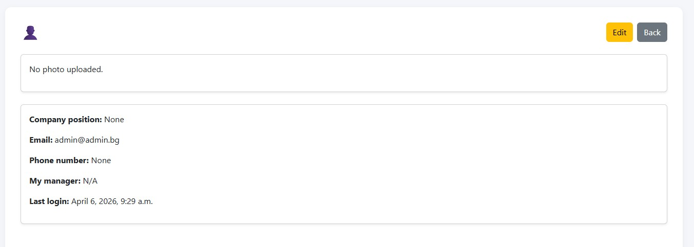
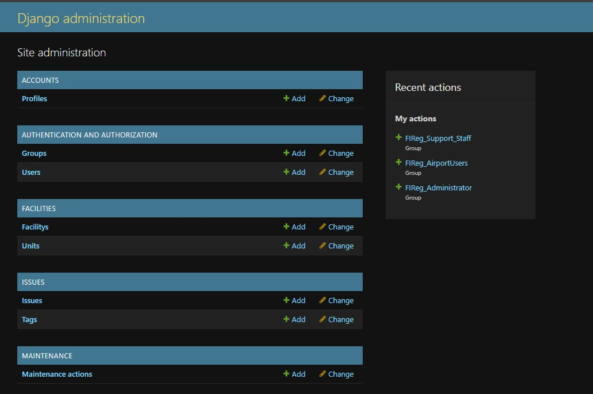
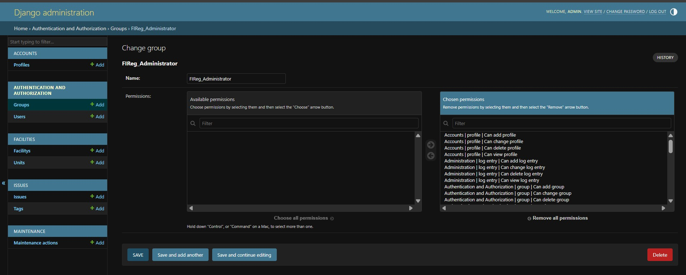

# Facility Issue Registry

Facility Issue Registry is a Django web application for managing technical issues across facilities and infrastructure assets. 
It helps teams register facilities, report incidents, track maintenance work, and follow issues through to resolution.

A demo version of the project is available online at: 
- https://facilityissueregestry-grgfemaya4e2d9d7.italynorth-01.azurewebsites.net
- Superuser Username: admin
- Superuser Password: admin

The project is built around a practical operational workflow:

- Register facilities and assign them to responsible units
- Report issues linked to a facility
- Track issue priority, status, and supporting tags
- Record maintenance actions, costs, and delivery requirements
- Manage user accounts and profile information

## Features

### Facility Management
- Create, edit, delete, and browse facilities
- Assign each facility to a responsible unit
- Store operational details such as location, cost center, manager, and installation date
- Upload facility images
- View facility dashboard and detailed facility pages

### Issue Management
- Create, edit, delete, and review issues
- Link issues to a specific facility
- Track issue priority and status
- Mark issues as critical
- Attach issue images
- Organize issues with tags
- View issues by unit

### Maintenance Tracking
- Create maintenance actions for a reported issue
- Track performer, performer name, delivery request, and cost
- Store timestamps for action start, edit, and resolution
- Resolve issues through maintenance workflows

### User Accounts
- User registration and login
- Logout flow
- Profile page and profile editing
- Extended profile information including phone number, birth date, position, manager, and photo

## Tech Stack

- Python 3.11
- Django 5.2
- PostgreSQL
- Django REST Framework
- Cloudinary
- WhiteNoise
- Bootstrap 5

## Project Structure

```text
facility_issue_registry/
├── accounts/                  # Authentication and user profiles
├── common/                    # Shared validators and mixins
├── facilities/                # Units and facilities
├── issues/                    # Issue reporting and tracking
├── maintenance/               # Maintenance actions
├── fixtures/                  # Initial data fixtures
├── static/                    # Static assets
├── templates/                 # Shared templates
├── facility_issue_registry/   # Project settings and URL config
├── manage.py
├── requirements.txt
└── README.md
```

## Main Apps

### `accounts`
Handles:
- registration
- login and logout
- user profiles

### `facilities`
Contains:
- `Unit`
- `Facility`

A facility belongs to a unit and stores operational metadata such as location, inventory number, and facility image.

### `issues`
Contains:
- `Tag`
- `Issue`

An issue belongs to a facility and supports status, priority, critical flag, image attachment, and tag relationships.

### `maintenance`
Contains:
- `MaintenanceAction`

A maintenance action belongs to an issue and records operational follow-up such as performer, delivery request, and cost.

## Data Model Overview

### Unit
Represents an organizational or responsible unit.

### Facility
Represents a tracked asset or location.

Key fields:
- name
- unit
- location
- cost center
- manager
- inventory number
- description
- installed date
- active status
- image

### Issue
Represents a reported problem related to a facility.

Key fields:
- location
- description
- requester
- priority
- status
- tags
- critical flag
- created and resolved timestamps
- image
- facility relationship

### MaintenanceAction
Represents work performed on an issue.

Key fields:
- action description
- performer
- performer name
- required parts
- delivery request
- cost
- timestamps
- issue relationship

### Profile
Extends the built-in Django user with:
- phone number
- birth date
- company position
- manager
- photo

## URL Overview

### Accounts
- `/` - login
- `/register/` - register new user
- `/logout/` - logout
- `/profile/<pk>/` - user profile
- `/profile/edit/<pk>/` - edit profile

### Facilities
- `/facilities/dashboard/` - dashboard
- `/facilities/list/` - facility list
- `/facilities/create/` - create facility
- `/facilities/<pk>/` - facility detail
- `/facilities/<pk>/edit/` - edit facility
- `/facilities/<pk>/delete/` - delete facility

### Issues
- `/issues/` - issue list
- `/issues/create/` - create issue
- `/issues/<pk>/detail` - issue detail
- `/issues/<pk>/edit` - edit issue
- `/issues/<pk>/delete/` - delete issue
- `/issues/<unit_pk>/issues/` - issues filtered by unit

### Maintenance
- `/maintenance/<issue_pk>/create/` - create maintenance action
- `/maintenance/<issue_pk>/resolve/` - resolve an issue through action flow

### Admin
- `/admin/`

## Requirements

Before running the project, make sure you have:

- Python 3.11 or later
- PostgreSQL installed and running
- A Cloudinary account for media storage
- `pip` and `venv`

## Installation

### 1. Clone the repository

```bash
git clone https://github.com/KrasiRalchev/Facility-Issue-Registry
cd Facility-Issue-Registry
```

### 2. Create and activate a virtual environment

#### Windows

```bash
python -m venv .venv
.venv\Scripts\activate
```

#### Linux / macOS

```bash
python -m venv .venv
source .venv/bin/activate
```

### 3. Install dependencies

```bash
pip install -r requirements.txt
```

## Environment Variables

Create a `.env` file in the project root, next to `manage.py`.

Example:

```env
SECRET_KEY=your-secret-key
DEBUG=True
DB_NAME=your-database-name
DB_USER=your-database-user
DB_PASSWORD=your-database-password
DB_HOST=127.0.0.1
DB_PORT=5432
ALLOWED_HOSTS=127.0.0.1,localhost
CSRF_TRUSTED_ORIGINS=http://127.0.0.1:8000,http://localhost:8000
CLOUDINARY_CLOUD_NAME=your-cloudinary-cloud-name
CLOUDINARY_API_KEY=your-cloudinary-api-key
CLOUDINARY_API_SECRET=your-cloudinary-api-secret
EMAIL_FROM=your-email@example.com
```

## Database Setup

### 1. Create a PostgreSQL database

Create a database manually in PostgreSQL and use its credentials in the `.env` file.

### 2. Run migrations

```bash
python manage.py makemigrations
python manage.py migrate
```

# ⚠ IMPORTANT -- Load Initial Data

Before creating Issues you must load the fixture data:

- JSON fixture for Django `loaddata`:

```bash
python manage.py loaddata fixtures/initial_units_facilities.json
```

This loads required **Units**, **Facilities** and **Tags** for the Issue form.


### Auth groups and permissions fixtures

The project also includes fixtures for Django auth groups and permissions:

- JSON fixture for Django `loaddata`:

```bash
python manage.py loaddata fixtures/auth_groups_permissions.json
```

- PostgreSQL `.dump` fixture for `psql` restore:

```bash
psql -h 127.0.0.1 -U postgres -d your_db_name -f fixtures/auth_groups_permissions.dump
```

Use the JSON fixture when you want a Django-native load process. Use the `.dump` file when you want to restore the same PostgreSQL table data directly.


## Running the Development Server

```bash
python manage.py runserver
```

Open the app at:

```text
http://127.0.0.1:8000/
```

## Static and Media Files

- Static files are served through Django and WhiteNoise
- Uploaded media is configured to use Cloudinary storage
- `STATIC_ROOT` is set to `staticfiles/`

## Authentication

The project uses Django's built-in authentication system with a custom `Profile` model connected through a one-to-one relationship.

The login page is configured as the default authentication entry point.

## Testing

Run tests with:

```bash
python manage.py test
```

## Deployment Notes

This project already includes a few production-oriented pieces:

- PostgreSQL configuration via environment variables
- WhiteNoise middleware for static files
- Cloudinary storage for uploaded media
- Environment-based secret management with `python-dotenv`

Before deployment, make sure to:
- set `DEBUG=False`
- configure `ALLOWED_HOSTS`
- configure `CSRF_TRUSTED_ORIGINS`
- provide valid Cloudinary credentials
- collect and serve static files properly if required by your hosting setup

## Screenshots

If you keep the current screenshots folder, you can showcase the UI here:

### Dashboard


### Issues


### Facilities


### Profile


### Groups


### Permissions


## Future Improvements

Possible future enhancements:
- full API routing for the existing DRF views
- advanced filtering and search
- notifications and email alerts
- role-based permissions
- issue history and audit logs
- reporting and analytics dashboards

## License

```text
This project was created for educational purposes only!
```

## Author

Created by Krasimir Ralchev.

https://github.com/KrasiRalchev/Facility-Issue-Registry
